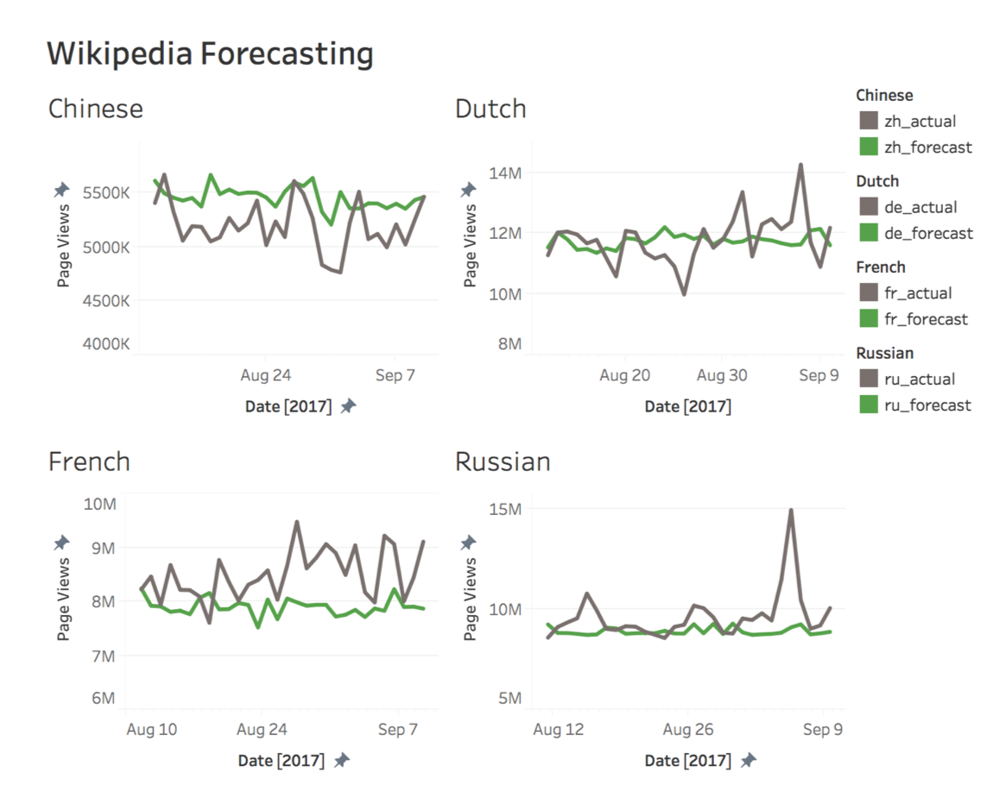

# Wikipedia Time Series Forecasting

In this project, I used one deep learning model to forecast for eight time series data. The data used for this project was downloaded from [Kaggle](https://www.kaggle.com/c/web-traffic-time-series-forecasting/kernels) and binned by language for a total of eight time series.

## Files

- **Wikipedia_Language_LSTM.ipynb** - This holds the code for the project, including visualizations and the code to train and test the model.
- **convergence_plot.png** - shown in the Jupyter notebook, this shows the training error for the LSTM.
- **lstm53_d7_d6.h5** - This file contains the weights for the bets performing LSTM. It can be directly imported into Keras.
- **Tableau_pt1 and pt2** - Screenshots of the tableau app I made to show performance of the model on future data.

## Notes
The best way to run the code is in an AWS Deep Learning instance. It makes training extremely quick. Since I use bayesian optimization, it is important to minimizee the train time per model. GPUs help immensely. 

## Example Performance

